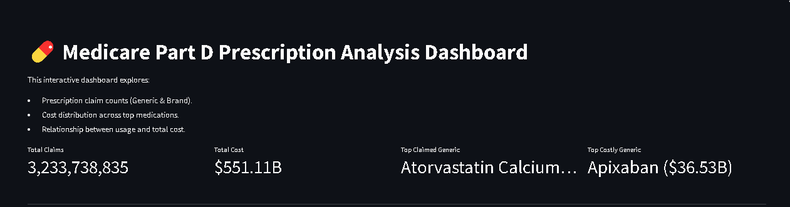
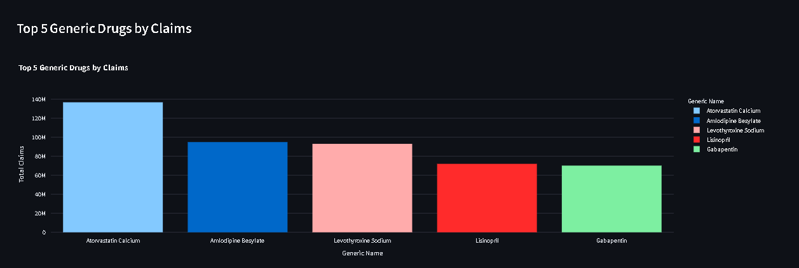
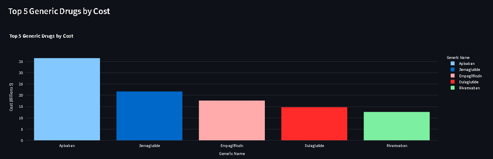

# Medicare Part D Analysis Dashboard
> An Interactive Streamlit Dashboard for analyzing Medicare Part D prescription and cost data.

---

## 🎯 Objective
This project analyzes Medicare Part D prescription data to:
- Identify the top prescribed generic and brand-name drugs.
- Highlight the top cost contributors.
- Evaluate the relationship between claim counts and total cost.
- Support actionable insights for stakeholders.

---

## ⚡️ Features
- ✅ Interactive KPI metrics for total claims, total cost, top claimed generic, and top costly generic.
- ✅ Visual breakdown of top generic and brand-name drugs by claim counts.
- ✅ Bar chart of top generic drugs by total cost.
- ✅ Correlation analysis between total claim counts and total cost.
- ✅ Exportable and actionable results for stakeholders.

---

## 📈 Results & Insights
✅ Generic medications dominate total claim counts.  
✅ A handful of expensive medications drive overall cost.  
✅ Low–moderate correlation (~0.25) suggests cost is not always directly tied to usage volume.

---

## 🖥️ Screenshots
### KPIs


### Top Generic Drugs by Claims


### Top Brand Name Drugs by Claims


### Top Generic Drugs by Cost


### Correlation Metric and Commentary


---

## 💻 Getting Started

### ✅ Prerequisites
Make sure you have **Python 3.9+** installed.

### ⚡️ Install Dependencies
```bash
pip install -r requirements.txt
```

### 🚀 Run the Streamlit App
```bash
streamlit run app.py
```

---

## 🔮 Future Improvements
- Incorporate regional and patient-level analytics.
- Evaluate clinical outcomes associated with high-cost medications.
- Identify opportunities for cost optimization and targeted negotiations.

---

## ⚖️ License
This project is licensed under the MIT License.
